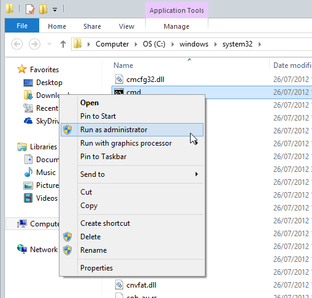
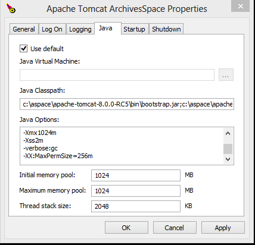

Running ArchivesSpace under Tomcat
----------------------------------

Before using these intructions, please have a look at the main documentation.
It a good idea to try out ArchivesSpace and be able to have it running in the
standard foreground mode ( using the archivesspace.bat or archivesspace.sh scripts).
Also, be sure to have your database setup and config.rb configured correctly.

ArchivesSpace is packaged as a set of `.war` files, so you can run it
under any servlet container you like.  Unless you have particular
needs, we recommend you use the standard method described in README.md
(which uses an embedded Jetty container).

However, if you have a burning desire to use Tomcat, the steps are:

  * Download the archivesspace zip distribution, and the Tomcat
    distribution.
  * Unpack the archivesspace distribution and modify the
    config/config.rb file to point to your MySQL database (if you're
    using MySQL).  Something like:

      AppConfig[:db_url] = "jdbc:mysql://localhost:3306/archivesspace?user=as&password=as123&useUnicode=true&characterEncoding=UTF-8"
  * Also in config/config.rb disable embedded solr and set solr url if you want to use an [external Solr instance](README_SOLR.md)

      AppConfig[:enable_solr] = false
      AppConfig[:solr_url] = "http://some.solr.org:8983/solr/archivesspace"
  * Unpack the Tomcat distribution
  * From your 'archivesspace' directory, use the 'configure-tomcat.sh'
    script to copy everything over to your Tomcat directory
  * Install the MySQL connector into Tomcat's 'lib' directory.

On my system, that looks like this:

     $ ls
     apache-tomcat-7.0.47.tar.gz  archivesspace-v1.1.0.zip

     # Unpack both
     $ tar xf apache-tomcat-7.0.47.tar.gz
     $ unzip -q archivesspace-v1.l.0.zip

     $ cd archivesspace

     (edit config/config.rb to include the AppConfig[:db_url] setting)

     # Now configure the Tomcat directory
     $ scripts/configure-tomcat.sh ../apache-tomcat-7.0.47
     Loading ArchivesSpace configuration file from path: /home/mst/tmp/tomcat/archivesspace/config/config.rb
     Loading ArchivesSpace configuration file from path: /home/mst/tmp/tomcat/archivesspace/config/config.rb
     Copying '/home/mst/tmp/tomcat/archivesspace/wars/backend.war' to '/home/mst/tmp/tomcat/apache-tomcat-7.0.47/webapps-backend/ROOT.war'
     Copying '/home/mst/tmp/tomcat/archivesspace/wars/frontend.war' to '/home/mst/tmp/tomcat/apache-tomcat-7.0.47/webapps-frontend/ROOT.war'
     Copying '/home/mst/tmp/tomcat/archivesspace/wars/public.war' to '/home/mst/tmp/tomcat/apache-tomcat-7.0.47/webapps-public/ROOT.war'
     Copying '/home/mst/tmp/tomcat/archivesspace/wars/indexer.war' to '/home/mst/tmp/tomcat/apache-tomcat-7.0.47/webapps-solr'
     Copying '/home/mst/tmp/tomcat/archivesspace/wars/solr.war' to '/home/mst/tmp/tomcat/apache-tomcat-7.0.47/webapps-solr/ROOT.war'
     Copying '/home/mst/tmp/tomcat/archivesspace/gems/gems/jruby-jars-1.7.6/lib/jruby-core-complete-1.7.6.jar' to '/home/mst/tmp/tomcat/apache-tomcat-7.0.47/lib'
     Copying '/home/mst/tmp/tomcat/archivesspace/gems/gems/jruby-jars-1.7.6/lib/jruby-stdlib-complete-1.7.6.jar' to '/home/mst/tmp/tomcat/apache-tomcat-7.0.47/lib'
     Copying '/home/mst/tmp/tomcat/archivesspace/lib/common.jar' to '/home/mst/tmp/tomcat/apache-tomcat-7.0.47/lib'
     Copying '/home/mst/tmp/tomcat/archivesspace/lib/jsoup-1.7.2.jar' to '/home/mst/tmp/tomcat/apache-tomcat-7.0.47/lib'
     Copying '/home/mst/tmp/tomcat/archivesspace/gems/gems/jruby-rack-1.1.12/lib/jruby-rack-1.1.12.jar' to '/home/mst/tmp/tomcat/apache-tomcat-7.0.47/lib'
     Copying '/home/mst/tmp/tomcat/archivesspace/gems' to '/home/mst/tmp/tomcat/apache-tomcat-7.0.47/lib'
     Copying '/home/mst/tmp/tomcat/archivesspace/locales' to '/home/mst/tmp/tomcat/apache-tomcat-7.0.47'
     Copying '/home/mst/tmp/tomcat/archivesspace/launcher/tomcat/files/setenv.sh' to '/home/mst/tmp/tomcat/apache-tomcat-7.0.47/bin'
     Writing server.xml
     Writing skeleton config file to /home/mst/tmp/tomcat/apache-tomcat-7.0.47/conf/config.rb

     # Grab the MySQL connector and put it somewhere Tomcat can find it
     $ cd ../apache-tomcat-7.0.47/lib
     $ curl -Oq http://repo1.maven.org/maven2/mysql/mysql-connector-java/5.1.24/mysql-connector-java-5.1.24.jar

     # Start Tomcat
     $ cd ../
     $ bin/startup.sh

If you left the ports as default in your config/config.rb file, you
should be able to connect to ArchivesSpace on http://localhost:8080/ at
this point (and the logs/catalina.out file will confirm that everything
started up)

## Running ArchivesSpace under Tomcat as a Windows service

The primary README contains a refrence to the following error:

"Note: If you're running Windows and you get an error message like unable to resolve type 'size_t' or no such file to load -- bundler, make sure that there are no spaces in any part of the path name in which the ArchivesSpace directory is located."

This also applies to Tomcat on Windows.  The default installation for Tomcat on Windows contains many spaces (ie, Program Files, Tomcat 7.0, etc).  You should install Tomcat to a folder without spaces, C:\Tomcat for example.

You can  use Tomcat to run ArchivesSpace as a Windows service.
Start by following the steps above to install ArchivesSpace into your
Tomcat directory (using `scripts\configure-tomcat.bat` instead of
`scripts/configure-tomcat.sh`).  Make sure you get the release
specifically for Windows (marked with something like "64-bit Windows
zip").

Once Tomcat is ready, open a command prompt as the administrator
user.  You can do that by right-clicking on cmd.exe and selecting "Run
as administrator" or, in recent versions of Windows, by selecting
"Open command prompt as administrator" from the "File" menu of any
explorer window.

From the command prompt, switch to your Tomcat directory.  I'm using
Tomcat8 to ensure compatibility with Windows 8, but Tomcat7 should be
fine.

     > cd c:\aspace\apache-tomcat-8.0.0-RC5

Now use Tomcat's `service.bat` script to install Tomcat as a Windows
service with a nice name:

     # If you don't have a service.bat file, check that you got the
     # Windows release of Tomcat.
     > bin\service.bat install ArchivesSpace

Before we can start the service, we will need to configure its memory
allocations.  To do this, run the Tomcat monitor program:

     # Use tomcat7w.exe if you're using Tomcat 7
     > bin\tomcat8w.exe //MS//ArchivesSpace

That command won't print anything, but you'll notice a small icon
appear in your taskbar:

Right-click that icon and select `Configure...`.  A window will appear
that looks something like this:

Click the `Java` tab and you'll see three settings for memory pools.
Set them as follows:

  * **Initial memory pool**: 1024
  * **Maximum memory pool**: 1024
  * **Thread stack size**: 2048

I've occasionally had some trouble getting these pool settings to
stick.  Lovers of small text boxes will have already noticed the `Java
Options` box, so let's add the equivalent Java options to the bottom
of that (one option per line):

     -Xms1024m
     -Xmx1024m
     -Xss2m
     -verbose:gc
     -XX:MaxPermSize=256m

The resulting settings should look like this:

Click `OK` to confirm everything and close the window.  Time to start
it up!

From the `Control Panel`, find your way to `Administrative Tools`, and
then to `Services`.  Near the top of the list you should see `Apache
Tomcat ArchivesSpace`.  Here you can change the service properties to
have it automatically start on boot, or just start the service
manually:

You'll find some log files written to the `logs` directory of your
Tomcat directory.  Generally the ones starting with `archivesspace`
are the most useful.
