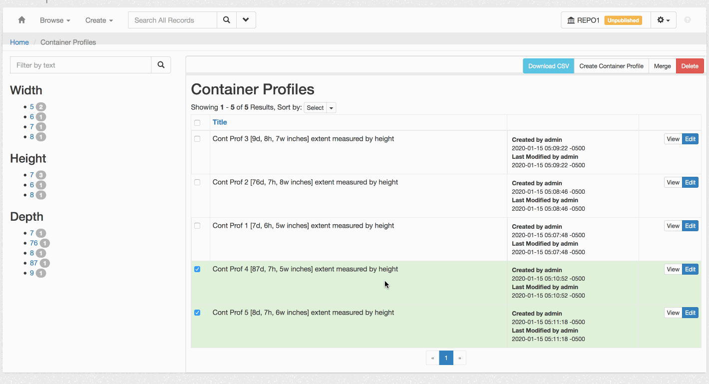

# Notes on ANW-550-confirm-merge-container-profiles

Here's a screenshot of the current lack of a confirmation modal for merging container profiles:

This work will build off of my work on [ANW-462-merge-top-containers](https://github.com/archivesspace/archivesspace/pull/1756).

## Related Files

### Model

### View

- frontend/app/assets/javascripts/browse_merge.js

- frontend/app/views/container_profiles/index.html.erb

  - the tool bar containing Merge button at http://localhost:3000/container_profiles

- frontend/app/assets/javascripts/utils.js

### Controller

## Solution discussion

The `batch_merge_modal_template` template in frontend/app/views/shared/\_templates.html.erb should be in a file in frontend/app/views/container_profiles/, like frontend/app/views/container_profiles/bulk_merge.html.erb

## Problems / bugs

- The modal headings (`title`) aren't internationalized, they are set via `AS.openCustomModal(id, title, content, size)`. This should be changed all around to be inline with internationalization efforts.

  - the `<h3>` in the `modal_custom_template` template in the file frontend/app/views/shared/\_templates.html.erb needs to be changed

- the js as written doesn't adhere to basic js conventions, like including snake casing variable names (see browse_merge.js (also, the filenaming as in this case is not camelCased))
